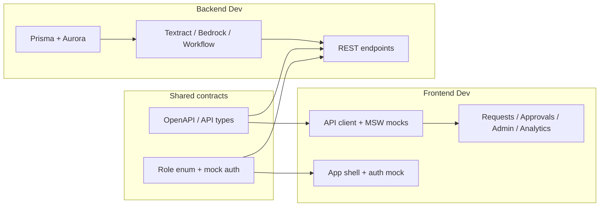

# Implementation Plan Overview

Shared roadmap for two developers working in parallel against [spec.md](./spec.md).

| Role | Owner | Plan |
|------|--------|------|
| Backend | Dev A | [plan-backend.md](./plan-backend.md) |
| Frontend | Dev B | [plan-frontend.md](./plan-frontend.md) |

---

## Parallel work model

**Rule**: Agree the API contract in Phase 0 before either side builds deep features. Frontend uses MSW mocks until backend endpoints are ready; backend ships stub responses early so UI can integrate.

---

## Phase 0 — Kickoff (both, Day 0)

1. Read [spec.md](./spec.md) together.
2. Freeze the **shared API contract** (paths, request/response shapes, error format) — see below.
3. Agree role names: `REQUESTER | HOD | FA | CA | CASHIER | ADMIN`.
4. Agree env vars: `DATABASE_URL`, `AWS_*`, `NEXT_PUBLIC_API_URL`.
5. Backend owns Prisma schema changes; frontend never invents fields without backend sign-off.

---

## Shared API contract (v1)

Base URL: `http://localhost:3001/api` (backend). Frontend: `http://localhost:3000`.

### Auth (mock for hackathon)
| Method | Path | Notes |
|--------|------|--------|
| POST | `/auth/login` | Body: `{ role }` → `{ token, user: { id, name, role } }` |
| GET | `/auth/me` | Current user from token |

### Master data
| Method | Path | Notes |
|--------|------|--------|
| GET/POST | `/stores` | Store CRUD (ADMIN write) |
| GET/POST | `/vendors` | Vendor CRUD |
| GET/POST | `/contracts` | Contract + terms per store |

### Invoices & payment requests
| Method | Path | Notes |
|--------|------|--------|
| POST | `/invoices/upload` | multipart PDF/XML → S3 + extract → Aurora rows |
| GET | `/invoices/:id` | Structured invoice + line items + S3 key |
| POST | `/requests` | Create payment request from invoice(s) |
| GET | `/requests` | List (filter by status, store, role) |
| GET | `/requests/:id` | Full dossier: invoice, validations, anomalies, workflow |
| POST | `/requests/:id/submit` | Start workflow |

### Approvals
| Method | Path | Notes |
|--------|------|--------|
| GET | `/approvals/pending` | Queue for current role |
| POST | `/approvals/:requestId/approve` | Body: `{ comment? }` |
| POST | `/approvals/:requestId/reject` | Body: `{ reason }` |
| POST | `/approvals/:requestId/sign` | Digital sign step (CA/Cashier as needed) |

### Analytics (ADMIN)
| Method | Path | Notes |
|--------|------|--------|
| POST | `/analytics/query` | Body: `{ prompt }` → `{ sql, rows, columns }` (SELECT-only) |

### Export
| Method | Path | Notes |
|--------|------|--------|
| GET | `/requests/:id/export` | CSV/JSON journal entries |

**Error shape**: `{ error: { code, message, details? } }`

---

## Sync checkpoints

| Checkpoint | When | What to demo together |
|------------|------|------------------------|
| C1 | End of Phase 1 | Login + role switch; empty dashboard; health API |
| C2 | End of Phase 2 | Upload invoice → structured detail page (mock or real extract) |
| C3 | End of Phase 3 | Full 5-level approve/reject on one request |
| C4 | End of Phase 4 | Admin NL analytics + ERP export |

---

## Suggested timeline (hackathon)

| Phase | Focus | Backend | Frontend |
|-------|--------|---------|----------|
| 1 | Foundation | Express TS, Prisma, seed, mock auth | App shell, layout, role switcher, API client |
| 2 | Invoices | S3 + Textract/Bedrock + Aurora persist | Upload UI, request create/detail |
| 3 | Workflow | State machine + approvals + audit | Approvals queue, progress bar, actions |
| 4 | Admin + AI | Text-to-SQL + export | Admin CRUD, analytics chat, export download |
| 5 | Polish | Tests, mocks, demo script | UI polish, MSW fallback, demo walkthrough |

---

## Ownership boundaries

| Owns | Backend | Frontend |
|------|---------|----------|
| Prisma / Aurora schema | Yes | No (consume types only) |
| AWS Textract / Bedrock / S3 | Yes | No |
| REST API | Yes | Consume + MSW |
| UI / UX | No | Yes |
| Mock Entra roles | Middleware + seed users | Role switcher UI |
| Text-to-SQL safety gate | Yes | Show SQL + results only |

---

## Definition of done (team)

- [ ] Invoice PDF/XML → structured Aurora rows + S3 artifact
- [ ] Request flows Requester → HOD → F&A → CA → Cashier with audit log
- [ ] Admin can ask NL questions and see SQL + table results
- [ ] Export CSV/JSON for one completed request
- [ ] Demo works with mock auth role switching
