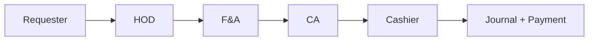
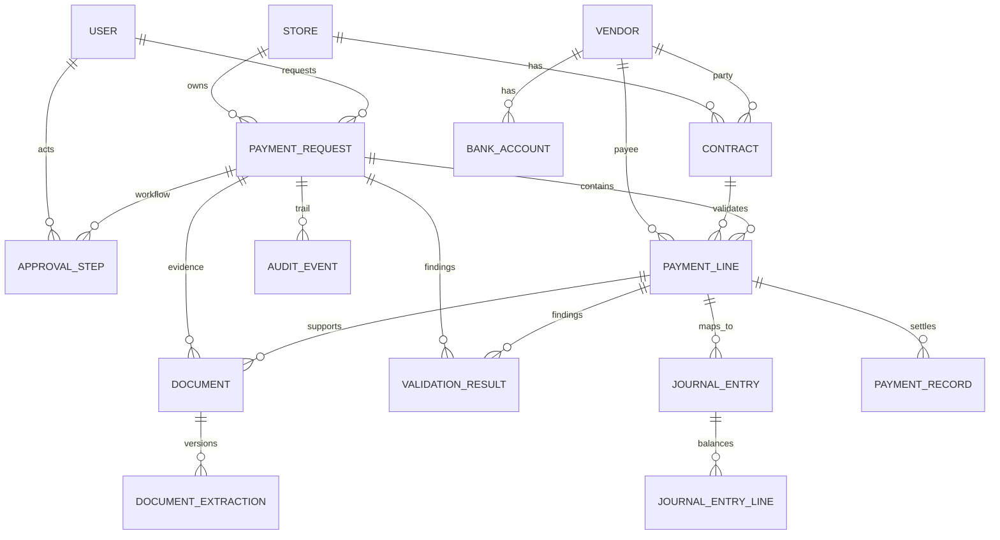
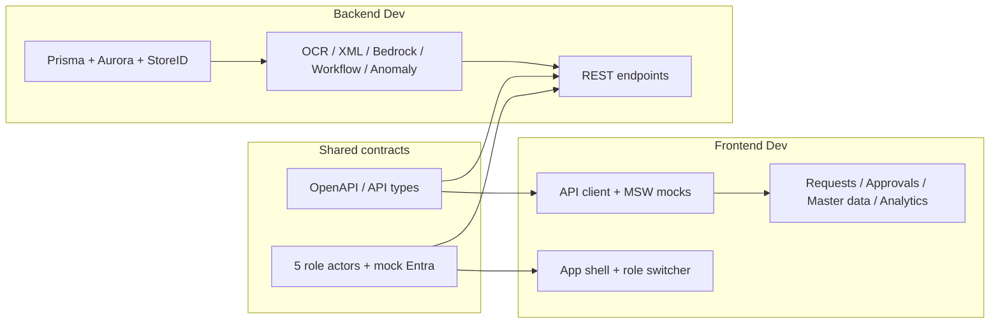

# Implementation Plan Overview

Shared roadmap for two developers working in parallel.

| Doc | Purpose |
|-----|---------|
| [problem-statement.md](./problem-statement.md) | P1 problem brief (source of truth for *why*) |
| [KFC_Recurring_Payment_System_Technical_Blueprint_v1.1.docx](./KFC_Recurring_Payment_System_Technical_Blueprint_v1.1.docx) | Core entities, states, APIs, MVP criteria |
| Architecture images | [02_59_09 PM.png](./ChatGPT%20Image%20Jul%2011,%202026,%2002_59_09%20PM.png) · [03_25_29 PM.png](./ChatGPT%20Image%20Jul%2011,%202026,%2003_25_29%20PM.png) |
| [spec.md](./spec.md) | Technical specification |
| [plan-backend.md](./plan-backend.md) | Backend developer plan |
| [plan-frontend.md](./plan-frontend.md) | Frontend developer plan |

| Dev role | Owner | Plan |
|----------|--------|------|
| Backend | Dev A | [plan-backend.md](./plan-backend.md) |
| Frontend | Dev B | [plan-frontend.md](./plan-frontend.md) |

---

## Problem → product mapping

| Pain today (problem statement) | What we build |
|--------------------------------|---------------|
| Paper 5-level chain; Excel + email | Digital dossier + role-gated workflow |
| Invoice re-keying | OCR / XML extract → structured Aurora rows |
| Duplicate payments hard to detect | Duplicate + anomaly flags before approve |
| No audit trail | Per-actor `AuditLog` on every action |
| Manual journal mapping | CSV/JSON export for legacy accounting |
| ~2 days monthly close | Target: **&lt; 2 hours**; **~80%** cycle-time cut |

**Scale context (seed / demo realism):** 250+ stores · ~255 contracts · ~300 requests/month · ~100 XML e-invoices/month · PDFs for contracts/supporting docs · keyed by **StoreID**.

**AI / automation (problem → stack):**

| Problem tech | Implementation |
|--------------|----------------|
| Computer Vision / OCR | Amazon Textract (PDF) |
| Document Intelligence | Textract + Bedrock (PDF/XML → structured invoice) |
| Anomaly / fraud detection | Duplicate + contract/budget anomaly services |
| RPA / workflow automation | Express state machine (5 actors) + journal export |

**Integrations required:** Microsoft Entra ID (mock SSO by role for hackathon) · Digital signature (KMS/mock) · Customer data protection (no secrets in code; sanitize uploads; audit access).

---

## Role actors (from problem: Requester → HOD → F&A → CA → Cashier)

There is **no** separate `ADMIN` role. Actors are the five paper-chain owners, mapped to impacted teams.

| Step | Enum | Actor | Team (problem) | Owns in the product |
|------|------|--------|----------------|---------------------|
| 1 | `REQUESTER` | Requester | Business / store function | Upload PDF/XML invoice; create multi-line payment request; submit |
| 2 | `HOD` | Head of Department | Business function leadership | Business approve / reject |
| 3 | `FA` | Finance & Accounting (F&A) | Finance + Accounting | Finance approve / reject; master data; NL analytics |
| 4 | `CA` | Chief Accountant (CA) | Accounting / control | Accounting mapping & journal readiness; digital sign |
| 5 | `CASHIER` | Cashier | Accounting / treasury | Final pay authorization; digital sign; payment settlement |

**Flow**: `Requester` → `HOD` → `F&A` → `CA` → `Cashier`

Only the actor for the **current** step may approve, reject, or sign. Wrong role → `403`.

Blueprint `User.role` also lists optional `ADMIN` for platform config; **MVP workflow uses the five actors only** (F&A owns master-data writes).



---

## Core business entities (Technical Blueprint v1.1)

**Sources**

- [KFC_Recurring_Payment_System_Technical_Blueprint_v1.1.docx](./KFC_Recurring_Payment_System_Technical_Blueprint_v1.1.docx)
- Architecture / ER visuals: [ChatGPT Image Jul 11, 2026, 02_59_09 PM.png](./ChatGPT%20Image%20Jul%2011,%202026,%2002_59_09%20PM.png) · [ChatGPT Image Jul 11, 2026, 03_25_29 PM.png](./ChatGPT%20Image%20Jul%2011,%202026,%2003_25_29%20PM.png)
- Problem brief: [problem-statement.md](./problem-statement.md)

### Design principles (blueprint)

1. **Payment Request** is the workflow container (one store + one period).
2. **Payment Line** is the accounting & validation unit (rent, electricity, water, service fee, …).
3. **Document** is evidence — request-level or line-level (`line_id` optional).
4. PDFs are **transformed, not replaced** — original file kept; extracted text + structured fields stored.
5. Approval **confirms** existing lines; it does not create them.
6. **Journal Entry** ≠ **Payment Record** — GL recognition vs cash movement.
7. MVP: *Extract everything → validate automatically → send only exceptions to humans.*

### Volume model (do not 1:1 collapse)

```
~300 Payment Requests / month
  └── 1..N Payment Lines   (RENT | ELECTRICITY | WATER | SERVICE_FEE | MAINTENANCE | OTHER)
        └── 0..N Documents (XML e-invoice | PDF contract | PDF bill | notice | acceptance | …)
```

~255 active contracts · vendor + bank master · ~100 XML e-invoices/month · PDFs for contracts/supporting docs · all keyed by **StoreID**.

### Entity relationship (canonical)



### Master data

| Entity | Key attributes (blueprint) | Notes |
|--------|----------------------------|--------|
| **STORE** | `store_id`, `store_code`, `store_name`, `cost_center_code`, `region`, `address`, `status` | Context for contracts, requests, anomalies |
| **USER** | `user_id`, `entra_object_id`, `email`, `display_name`, `role`, `department`, `status` | Roles: `REQUESTER`, `HOD`, `FA`/`F_AND_A`, `CA`, `CASHIER` (+ optional `ADMIN`) |
| **VENDOR** | `vendor_id`, `vendor_code`, `legal_name`, `normalized_name`, `tax_id`, `vendor_type`, `status`, `risk_level` | Tax ID strongest identity key |
| **BANK_ACCOUNT** | `bank_account_id`, `vendor_id`, `bank_name`, `bank_code`, **encrypted** account number + hash, `account_name`, `valid_from`/`valid_to`, `is_active`, `verification_status` | Never log raw account numbers |
| **CONTRACT** | `contract_id`, `contract_number`, `store_id`, `vendor_id`, `contract_type` (RENT/SERVICE/…), dates, `base_amount`, `currency`, billing/escalation/tax JSON rules, `status`, `current_version` | ~255 active; AI-extracted terms need human confirm before authoritative |

### Core transactional aggregate

| Entity | Role in domain | Key attributes |
|--------|----------------|----------------|
| **PAYMENT_REQUEST** | Workflow container | `request_id`, `request_number`, `store_id`, `requester_id`, `payment_period` (YYYY-MM), `currency`, `total_amount` (**derived** from lines), `status`, `risk_level`, `current_approval_level`, `version` |
| **PAYMENT_LINE** | Expense / validation / pay unit | `line_id`, `request_id`, `line_number`, `expense_type`, `vendor_id`, `contract_id?`, `bank_account_id?`, amounts (net/tax/gross), `invoice_number`/`invoice_date`, `status`, `risk_score`, `source` (`MANUAL`/`XML_PARSED`/`AI_PROPOSED`), `confirmed_by` |
| **DOCUMENT** | Immutable evidence file | `document_id`, `request_id` (**required**), `line_id?`, `contract_id?`, `file_name`, `mime_type`, `file_format` (XML/PDF/…), `storage_uri`, `sha256_hash`, `document_type`, `processing_status`, `uploaded_by` |
| **DOCUMENT_EXTRACTION** | Versioned AI/parser output | `extraction_id`, `document_id`, `engine`, `extraction_method`, `raw_text`, `structured_fields` (JSONB), `page_data`, confidences, `status` |

**Document types**: `E_INVOICE`, `CONTRACT`, `CONTRACT_APPENDIX`, `PAYMENT_NOTICE`, `ACCEPTANCE_RECORD`, `UTILITY_BILL`, `SUPPORTING_SCHEDULE`, `OTHER`

### Validation, workflow, accounting, settlement

| Entity | Purpose | Key attributes |
|--------|---------|----------------|
| **VALIDATION_RESULT** | Rules + anomaly findings | `validation_type` (`DUPLICATE`, `VENDOR_MATCH`, `BANK_MATCH`, `CONTRACT_AMOUNT`, `CONTRACT_DATE`, `AMOUNT_ANOMALY`, `DOCUMENT_COMPLETENESS`, `XML_PDF_CONSISTENCY`, `TAX_CHECK`, …), `severity` (INFO/WARNING/HIGH/BLOCKING), `evidence` JSON, `recommended_action` |
| **APPROVAL_STEP** | Instantiated at submit | `sequence_number`, `role_required` (HOD/FA/CA/CASHIER), `status`, `comments`, `signature_*` |
| **JOURNAL_ENTRY** | GL document from approved line | `request_id`, `line_id`, `journal_date`, `status`, `legacy_reference`, `created_by_type` |
| **JOURNAL_ENTRY_LINE** | Balanced debit/credit rows | `account_code`, `debit_amount`, `credit_amount`, cost center |
| **PAYMENT_RECORD** | Cash movement / settlement | `line_id`, `payment_date`, `paid_amount`, `payment_method`, `reference_no`, `status` |
| **AUDIT_EVENT** | Immutable trail | actor, role, action, payload, correlation id, timestamp |

### Cardinality rules (must hold)

| Relationship | Cardinality |
|--------------|-------------|
| STORE → PAYMENT_REQUEST | 1:N |
| PAYMENT_REQUEST → PAYMENT_LINE | 1:N (≥1 active line before submit) |
| PAYMENT_REQUEST → DOCUMENT | 1:N (every doc has `request_id`) |
| PAYMENT_LINE → DOCUMENT | 1:N via optional `document.line_id` |
| PAYMENT_REQUEST → APPROVAL_STEP | 1:N (created on submit) |
| DOCUMENT → DOCUMENT_EXTRACTION | 1:N (versioned; never overwrite) |
| PAYMENT_LINE → VENDOR | N:1 |
| PAYMENT_LINE → CONTRACT | N:0..1 |
| VENDOR → BANK_ACCOUNT | 1:N (effective-dated) |
| PAYMENT_LINE → JOURNAL_ENTRY | 1:N |
| JOURNAL_ENTRY → JOURNAL_ENTRY_LINE | 1:N (must balance) |

### State machines (blueprint)

**Payment Request**:  
`DRAFT` → `EXTRACTING` → `READY` → `SUBMITTED` → `IN_REVIEW` → (`CHANGES_REQUESTED` | `REJECTED` | `APPROVED`) → `POSTING` → `POSTED` → `PAYMENT_PROCESSING` → `PAID` · also `CANCELLED`

**Payment Line**:  
`DRAFT` → `EXTRACTED` → `VALIDATING` → (`PASS` | `WARNING` | `HIGH_RISK` | `BLOCKED`) → `APPROVED`/`REJECTED` → `POSTED` → `PAID`

**Approval roles (blueprint §10)**

| Role | Responsibility |
|------|----------------|
| Requester | Create request, upload docs, confirm AI-proposed lines |
| HOD | Business need & budget ownership |
| F&A | Documents, vendor, contract, tax, risk findings |
| CA (Chief Accountant) | Accounting mapping & journal readiness |
| Cashier | Payment execution readiness & settlement |

### End-to-end flow (blueprint + architecture image)

```
CREATE REQUEST → UPLOAD DOCUMENTS → PARSE XML / EXTRACT PDF / OCR
  → CLASSIFY + EXTRACT FIELDS → PROPOSE PAYMENT LINES → USER CONFIRMS
  → VALIDATE + SCORE RISK → SUBMIT + APPROVE (5 roles)
  → CREATE/POST JOURNAL ENTRIES → EXECUTE PAYMENT → CLOSE + ANALYZE
```

### Entity CRUD ownership

| Entity group | Write |
|--------------|--------|
| Store, Vendor, BankAccount, Contract | `FA` (MVP) |
| PaymentRequest, PaymentLine confirm, Document upload | `REQUESTER` |
| ValidationResult | System |
| ApprovalStep actions + signature | Matching role |
| JournalEntry / JournalEntryLine | System + `CA`/`FA` review; post after approve |
| PaymentRecord | `CASHIER` |
| AuditEvent | System (append-only) |
| DocumentExtraction | System (async pipeline) |

---

## Parallel work model



**Rule**: Freeze API contract in Phase 0. Frontend uses MSW until each slice is live; backend ships stubs early.

---

## Phase 0 — Kickoff (both)

1. Read [problem-statement.md](./problem-statement.md) + blueprint entities in this plan + [spec.md](./spec.md).
2. Freeze API contract below (aligned to blueprint §12).
3. Roles: `REQUESTER | HOD | FA | CA | CASHIER` (workflow); optional `ADMIN` not required for MVP.
4. Env: `DATABASE_URL`, `AWS_*`, `NEXT_PUBLIC_API_URL`.
5. Backend owns Prisma entity model from blueprint; frontend consumes types only.

---

## Shared API contract (v1 — blueprint-aligned)

Base URL: `http://localhost:3001/api` · Frontend: `http://localhost:3000`.

### Auth (mock Entra — five actors)
| Method | Path | Notes |
|--------|------|--------|
| POST | `/auth/login` | `{ role }` ∈ five actors → `{ token, user }` |
| GET | `/auth/me` | Current actor |

### Master data (`FA` write)
| Method | Path | Notes |
|--------|------|--------|
| GET/POST | `/stores` | Store master |
| GET/POST | `/vendors` | Vendor master |
| GET/POST | `/vendors/:id/bank-accounts` | Encrypted bank accounts |
| GET/POST | `/contracts` | Active contracts per store |

### Payment requests & lines (core aggregate)
| Method | Path | Notes |
|--------|------|--------|
| POST | `/payment-requests` | Create DRAFT (`storeId`, `paymentPeriod`) — `REQUESTER` |
| GET | `/payment-requests` | Filter store, period, status, risk |
| GET | `/payment-requests/:id` | Aggregate: header, lines, documents, validations, approvals, audit |
| POST | `/payment-requests/:id/lines` | Manual / confirmed line |
| POST | `/payment-requests/:id/lines/propose` | AI/XML propose lines |
| PATCH | `/payment-lines/:id` | Edit before submit |
| POST | `/payment-requests/:id/validate` | Run validation engine |
| POST | `/payment-requests/:id/submit` | Lock + instantiate `APPROVAL_STEP`s |

### Documents & extraction
| Method | Path | Notes |
|--------|------|--------|
| POST | `/payment-requests/:id/documents` | Upload XML/PDF → S3 + `DOCUMENT` + hash |
| GET | `/documents/:id` | Metadata |
| POST | `/documents/:id/process` | Queue extraction |
| GET | `/documents/:id/extractions/latest` | Latest `DOCUMENT_EXTRACTION` |

### Approvals
| Method | Path | Notes |
|--------|------|--------|
| GET | `/approvals/pending` | Queue for current role |
| POST | `/approval-steps/:id/actions` | `approve` / `reject` / `request_changes` (+ signature fields) |

### Accounting & payment
| Method | Path | Notes |
|--------|------|--------|
| POST | `/payment-lines/:id/journal-entries` | Draft journal from line |
| POST | `/journal-entries/:id/post` | Mock API/RPA post → `legacy_reference` |
| POST | `/payment-records` | Cashier settlement record |
| GET | `/payment-requests/:id/export` | CSV/JSON journal package |
| GET | `/payment-requests/:id/audit-events` | Audit timeline |

### Analytics (`FA`)
| Method | Path | Notes |
|--------|------|--------|
| POST | `/analytics/query` | NL → safe `SELECT` → `{ sql, columns, rows }` |

**Error shape**: `{ error: { code, message, details? } }`

---

## Sync checkpoints

| Checkpoint | Demo |
|------------|------|
| C1 | Login as 5 actors; master data seeded; create DRAFT request |
| C2 | Upload XML/PDF → extraction → propose/confirm **Payment Lines** |
| C3 | Validate (duplicate/anomaly) → submit → 5-role approve with audit |
| C4 | Journal draft/post + PaymentRecord + F&A analytics |

---

## Suggested timeline (blueprint §17, hackathon-compressed)

| Phase | Focus | Backend | Frontend |
|-------|--------|---------|----------|
| 1 | Foundation | Store, User, Vendor, BankAccount, Contract, PaymentRequest, PaymentLine + CRUD | Shell, role switcher, Payment Inbox, Create Request shell |
| 2 | Document layer | Document upload, SHA-256, association, process queue stub | Upload UI, doc list on request |
| 3 | Extraction | XML parser → PDF/OCR/Bedrock → DocumentExtraction | Processing status, extraction preview |
| 4 | Line proposal + validation | Propose/confirm lines; ValidationResult engine | AI line review, validation banners |
| 5 | Workflow | Approval_STEP + AuditEvent + signatures | Approval workspace, audit timeline |
| 6 | Accounting + payment | JournalEntry(+Line), PaymentRecord, mock post/export | Accounting workspace, export, payment confirm |
| 7 | Polish | Analytics text-to-SQL, fixtures, tests | MSW fallback, demo script by role |

---

## Ownership boundaries

| Owns | Backend | Frontend |
|------|---------|----------|
| Blueprint entity model / Prisma | Yes | Consume DTOs |
| XML/PDF/OCR/Bedrock extraction | Yes | Show status + fields |
| Validation + risk | Yes | Findings UI |
| Workflow + signatures | Yes | Approval workspace |
| UI screens (blueprint §16) | No | Yes |
| Text-to-SQL safety | Yes (`FA`) | Show SQL + results |

---

## Definition of done (blueprint §19 + problem metrics)

- [ ] Requester creates DRAFT for one Store + period
- [ ] Upload XML + PDF; processing status visible
- [ ] XML parsed without OCR; PDF text/OCR stored as versioned DocumentExtraction
- [ ] System proposes Payment Lines; requester confirms/edits
- [ ] Request total = sum of active lines
- [ ] Documents link to request and/or specific lines
- [ ] Exact duplicate + vendor/bank + contract/history anomaly checks
- [ ] Five roles: approve / reject / request changes + audit timeline
- [ ] Approved lines → balanced draft journals + mock legacy reference
- [ ] Cashier can record payment; F&A can run NL analytics
- [ ] Demo narrative: ~80% cycle-time cut / close from ~2 days toward &lt; 2 hours
